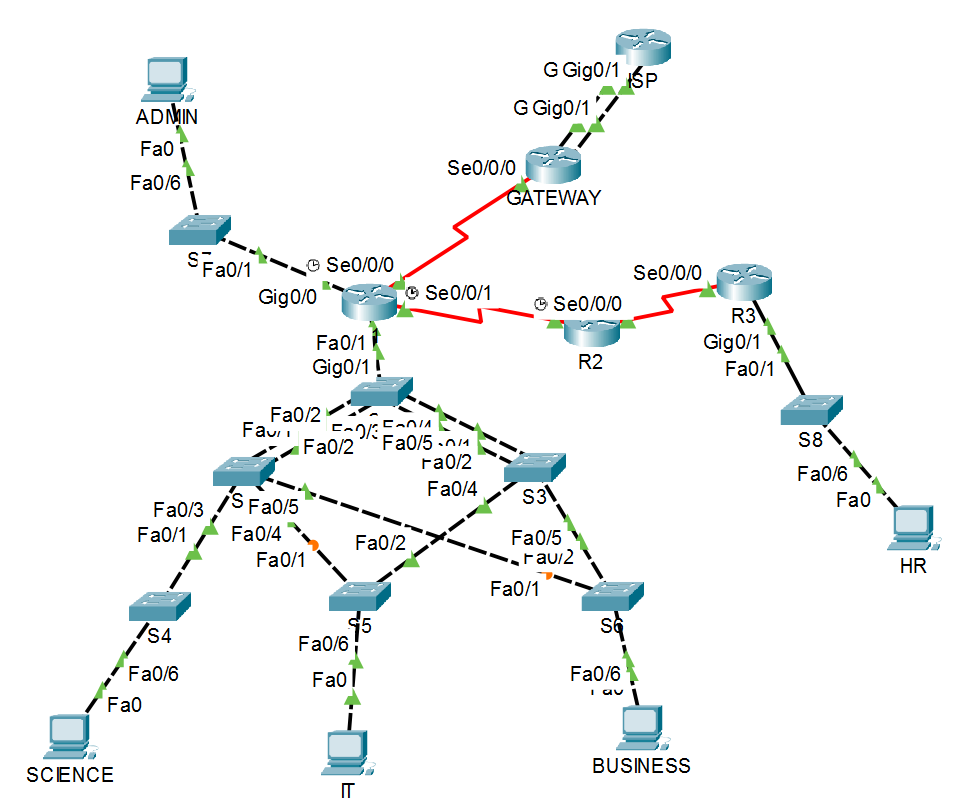

# Skills-Based Networking Assessment
This repository contains my Networking Assessment completed in Cisco Packet Tracer. 
This project is a routing and switching assessment where I act as the network engineer. I design and configure a multi-VLAN network that connects to an ISP.

## Task Requirements
- Design IPv4 subnets using VLSM from a given /22 block and apply IPv6 addressing.
- Configure routers, switches, VLANs, trunking, EtherChannel, port security, STP, DHCPv4, and SLAAC.
- Implement static IPv4 and IPv6 routing, including redundant ISP links with backup routes and appropriate AD.
- Verify connectivity with specified ping tests between VLANs, loopbacks, and the simulated Internet

## Repository Contents
- `Network_config.pka` – Cisco Packet Tracer activity file of the completed network.
- `Configured_Network.png` – Screenshot of the final network topology.
- 'Network_Config_Requirements.pdf' - Assessment file
- `README.md` – Project description and instructions.

## How to Open
1. Download and install [Cisco Packet Tracer](https://www.netacad.com/courses/packet-tracer).
2. Open `Network_config.pka` in Packet Tracer to view or interact with the network.
3. Refer to `Configured_Network.png` for a visual overview of the final setup.

## Network Topology

